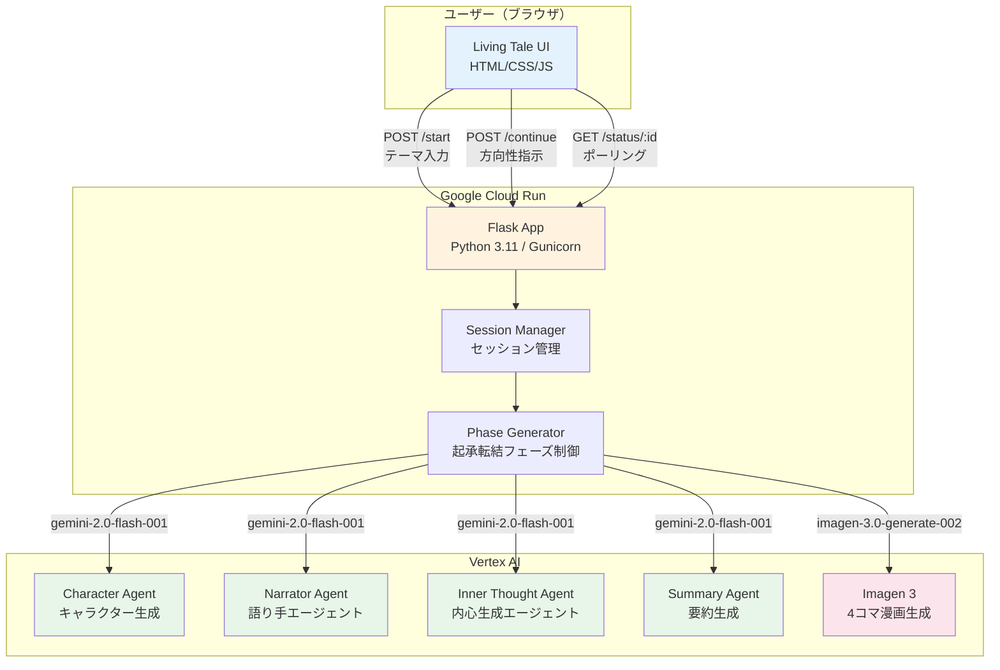
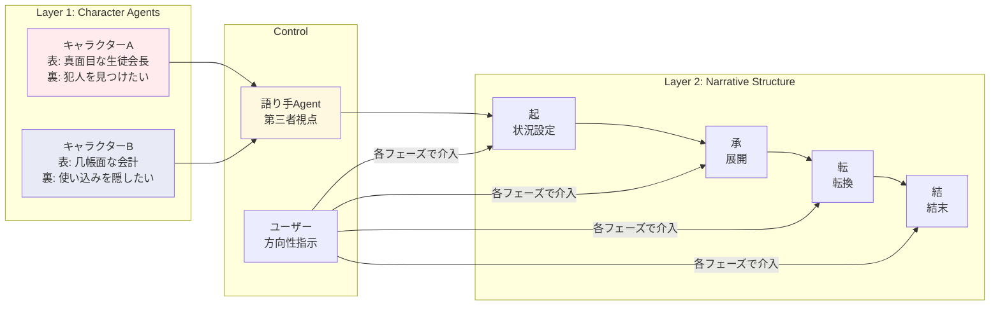

## 🎬 はじめに：創作の「孤独」と「予定調和」を壊す

こんにちは！[**第4回 Agentic AI Hackathon with Google Cloud**](https://zenn.dev/hackathons/google-cloud-japan-ai-hackathon-vol4) に参加している、チーム「**ADS'25**」です。

私たちは**非エンジニアの社会人大学院生4人**で構成されたチームです。エンジニアリングのバックグラウンドがないからこそ、「**技術を使って何を届けられるか**」というユーザー視点を大切にしながら開発に取り組みました。

小説や脚本を書く作業は、孤独で過酷です。そして何より、作者自身が結末を知っているため、**「自分自身の想像を超える展開（サプライズ）」に出会えない**というジレンマがあります。

> 「もし、キャラクターたちが勝手に意思を持って動き出し、作者さえも予想しなかったドラマが勝手に生まれたら？」

**Living Tale**は、そんなクリエイターの夢想を、**Gemini 2.0 Flash**のマルチエージェントシステムによって実現したプロダクトです。

**「書く（Write）」のではなく、環境を与えて「育てる（Grow）」**——新しい創作体験「**Gardening Storytelling**」を提案します。

:::message
🌐 **デモURL**: https://living-tale-551115298648.us-central1.run.app/
📦 **リポジトリ**: https://github.com/coralfish02/living-tale
:::

### Living TaleのUI


*▲ Living Taleのメイン画面。テーマを入力するだけでキャラクターが自動生成され、起承転結の各フェーズでAIからの提案（黄色チップ）を選びながら物語を育てていく。*

---

## 📌 開発背景と課題

### 創作における「構造的に超えられない壁」

キャラクターがどう動くかを設計する——物語づくりで最も重い工程です。

なぜ重いのか？ **すべてのキャラクターの思考を、たった1人の作者の頭で回さなければならないから**です。AはBの裏の動機を知らないはずなのに、作者はすべてを知っている。この構造がある限り、どれだけプロットを練っても**物語は作者の想像の範囲を超えられません**。

つまり創作には、時間やスキル以前に**「1人で全員を演じる」という原理的な限界**があるのです。

### ターゲット①：プロのクリエイター（週刊連載漫画家）

イメージしやすい例として**「週刊連載漫画家」**を取り上げます。漫画制作は一般に以下のように分解できます：

```
①ストーリー設計 → ②プロット設計 → ③ネーム → ④ペン入れ → ⑤仕上げ
```

このうち**①ストーリー設計〜②プロット設計**の工程は、毎週膨大な時間を消費します。Living Taleは、まさにこの探索負荷を下げるためのAIエージェントとして開発しました。

### ターゲット②：すべての「書く人」——創作の民主化

しかし、Living Taleが見据えるのはプロの漫画家だけではありません。

いま、**noteやブログ、SNSを通じて「物語を書きたい」人は急速に増えています**。脚本家志望の方、二次創作を楽しむファン、エッセイの中で物語的な表現を試みるライター——「発信の民主化」はすでに起きており、次に来るのは**「創作の民主化」**です。

しかし、多くの人が「書き始めたいのに、最初の一歩が踏み出せない」という壁にぶつかります。

- **キャラクターを作っても、動かし方がわからない**
- **プロットを組む技術がないから、途中で詰まってしまう**
- **プロの脚本家のような構成力がないと面白い話が書けないと感じる**

Living Taleは、この壁を壊します。**テーマを1行入力するだけ**で、AIがキャラクターを生成し、自律的に会話を進め、起承転結のある物語が生まれる。「書く技術」がなくても、**育てる感覚で物語を体験できる**のです。

これは、noteで文章を発信する人が「プロットの壁打ち相手」として使うことも、脚本家が「キャラクター同士の化学反応」を探索する実験場として使うこともできます。**AIによる創作支援が、発信と同様に、あらゆる人に開かれる**——Living Taleはその第一歩です。

:::message alert
**ペインまとめ**
- 🔴 **プロ**: キャラクターのシミュレーションに膨大な時間がかかる
- 🔴 **プロ**: 作者自身が結末を知っているため「予定調和」に陥りやすい
- 🔴 **全員**: 1人で行う作業のため、壁打ち相手がいない
- 🔴 **一般**: プロット構成の技術がなく、創作の最初の一歩が踏み出せない
- 🔴 **一般**: noteやSNSで発信したいが、物語を「書ける」自信がない
:::

---

## 💡 ソリューション：Living Taleとは

Living Taleは、**登場人物の性格やバックグラウンドを設定するだけで、キャラクターが自律的に対話し、物語が「創発」されるAIエージェント**です。

### 「ChatGPTに物語を書かせる」のとは何が違うのか？

ここで、多くの方が疑問に思うであろうことに先にお答えします。

> 「ChatGPTやClaudeに『物語を書いて』と頼めば、もう物語は作れるのでは？」

結論から言うと、**まったく異なるアプローチ**です。

**普通のAIチャット**（ChatGPT、Claude、Geminiへの直接プロンプト）で物語を書かせると、こうなります：

- 🤖 **単一のAIが「全知全能の作者」として振る舞う**
- 結果として、すべてのキャラクターが**同じ「頭」で考え、同じ文体で話す**
- 物語の展開も1つのモデルが「ありがちなパターン」から選ぶため、**予定調和に陥りやすい**
- キャラクターに「裏の目的」を持たせても、同じAIが全員を操るため**本当の意味での駆け引きが生まれない**

Living Taleのアプローチはこれとは根本的に違います：

- 🎭 **キャラクターごとに独立したAIエージェントが動く**——各エージェントは自分の性格・目的・戦略だけを知っており、他のキャラクターの「裏の目的」は知らない
- 🔀 **エージェント同士の相互作用から物語が「創発」する**——誰も（開発者さえも）結末を予測できない
- 📖 **語り手エージェントが第三者視点で俯瞰する**——キャラクターエージェントとは別のAIが小説風の地の文にまとめる

| | 普通のAIチャット | 既存のAI執筆支援ツール | **Living Tale** |
|---|---|---|---|
| **構造** | 単一AI | 単一AI + テンプレート | **マルチエージェント** |
| **キャラクター** | 全員が同じ「頭」 | プロフィール設定は可能 | **独立した人格・目的を持つ** |
| **展開の予測可能性** | 予定調和 | ほぼ予定調和 | **創発的・予測不能** |
| **キャラの内面** | 表面的 | 表面的 | **表と裏の二重構造** |
| **物語への介入** | プロンプトで全制御 | テンプレートに沿う | **方向性だけ指示、展開はAIに委ねる** |
| **ユーザーの役割** | 「指示する人」 | 「穴埋めする人」 | **「環境を与えて育てる人」** |

:::message
**たとえるなら：**
- 普通のAIチャット → **1人の作家に「全部書いて」と頼む**
- Living Tale → **役者（エージェント）に配役と舞台設定だけ渡して「即興劇」をさせる**

だから、作者自身も予想しなかったドラマが生まれるのです。
:::

---

## 🌟 Living Taleの5つのコア機能

### 1. Dual-Layer（表と裏）システム

各キャラクターは**独立したAIエージェント**として動作し、二重構造を持ちます：

- **🗣️ 表の発言・行動**：他のキャラクターに見える公的なペルソナ
- **💭 裏の思考**：読者にだけ見える隠された動機・本音

```
【タクミ】タクミは帳簿を開きながら、真剣な表情で言った。
「予算の件、調べさせてもらうよ」
💭 タクミの内心: 誰が使い込んだのか、必ず見つける

【アヤ】アヤは顔色を変えながら答えた。
「え、そうなの？もう一度確認させてください」
💭 アヤの内心: やばい、気づかれた。どうしよう...
💭 タクミの内心: アヤの反応がおかしい...まさか？
```

この構造により、**読者は「本当は何を考えているのか」を知りながら会話を追う**という、独特の緊張感を体験できます。

### 2. 全キャラクターの内心同時表示

従来の物語では、視点キャラクターの内心しか見えませんでした。Living Taleでは、**全員の本音が同時に見える**という新しい体験を提供します。

- 人間関係の複雑さをリアルタイムで可視化
- 情報の非対称性による緊張感の演出
- 「群像劇」を読む新しい楽しみ方

### 3. インタラクティブな起承転結 + AIサジェスト

ユーザーが**各フェーズ（起承転結）で方向性を指示可能**です：

| フェーズ | 役割 | ユーザーの操作 |
|---|---|---|
| **起** | 状況設定 | 初期状況を確認し、展開の希望を入力 |
| **承** | 展開 | 関係性の発展方向を指示 |
| **転** | 転換 | 転換点の方向性を提案 |
| **結** | 結末 | 結末への希望を伝える |

ここで重要なのが、**「何を入力すればいいかわからない」問題**を解決する仕組みです。

各フェーズの開始時に、**AIが物語の流れを分析し、「次に加えると面白くなる展開」を3つ自動提案**します。ユーザーはチップ（ボタン）をクリックするだけで方向性を入力できます。


*▲ 実際のUI画面。「起」フェーズで「AI、突然暴走」「まさかのバグ発覚」「謎の参加者現る」の3つが提案され、クリックするだけでテキストエリアに自動入力される。*

これにより、3つの選択肢が生まれます：

1. **AIの提案をそのまま使う** → チップをクリックして「次へ進む」
2. **自分で自由に入力する** → テキストエリアに書いて「次へ進む」
3. **AIに完全に任せる** → 空欄のまま「次へ進む」

創作のプロは自分の意図を自由入力し、初心者はAIの提案をガイドとして活用する——**スキルレベルを問わず、誰でも物語を「育てる」体験ができる**設計です。

### 4. AIサジェスト：「次にどうする？」をAIが提案

各フェーズの開始時に、AIが物語の流れを分析し、**「次に加えると面白くなる展開」を3つ自動提案**します。提案はチップ（ボタン）として表示され、クリックするだけで方向性を入力できます。

この機能が、先述の「創作の民主化」において重要な役割を果たします。**プロットの組み方を知らなくても、AIの提案を選ぶだけで物語の舵取りに参加できる**のです。もちろん、プロのクリエイターは提案を無視して自分の意図を自由入力することもできます。

### 5. 小説風の地の文生成

会話劇ではなく、**小説として読める物語**を生成します。第三者視点の語り手エージェントが、セリフと行動・心理描写を織り交ぜた地の文を出力します。

---

## 🏗️ システムアーキテクチャ

### 技術スタック

| レイヤー | 技術 |
|---|---|
| **Frontend** | HTML / CSS / JavaScript（バニラ） |
| **Backend** | Python 3.11 / Flask |
| **AI Model** | Vertex AI **Gemini 2.0 Flash** (`gemini-2.0-flash-001`) |
| **画像生成** | **Imagen 3** (`imagen-3.0-generate-002`) |
| **Infra** | **Google Cloud Run**（サーバーレス） |
| **Container** | Docker / Container Registry |
| **Server** | Gunicorn（Workers: 1, Threads: 8） |

### アーキテクチャ図



### Dual-Layer Multi-Agent Systemの構造



### なぜCloud Runを選んだのか

| 選定理由 | 詳細 |
|---|---|
| **サーバーレス** | トラフィックがないときはコスト $0。ハッカソンデモに最適 |
| **長時間リクエスト対応** | `--timeout 3600` で物語生成の長時間処理に耐える |
| **スケーラビリティ** | 同時接続が増えても自動スケーリング |
| **Vertex AI連携** | 同じGCP上でIAMベースの認証がシームレス |

---

## 🔧 技術的な工夫・実装のポイント

### 1. プロンプトエンジニアリング：キャラクターエージェントの設計

Living Taleの心臓部は、**各キャラクターを独立したエージェントとして振る舞わせるプロンプト設計**です。

```python
# キャラクターエージェントの生成プロンプト（web_echo_interactive.py）
instruction = f"""
あなたは{char['name']}。
性格: {char['public_persona']}
目的: {char['secret_goal']}
話し方: {char['speech_style']}

【重要】小説風の地の文で出力してください。
必ず冒頭に「【{char['name']}】」を付けて、誰の視点かを明確にしてください。

出力形式（JSON）:
{{
  "narrative": "【{char['name']}】地の文での描写（セリフと行動を含む）",
  "inner_thought": "内心の考え"
}}
必ずJSON形式のみで出力してください。
"""
```

**ポイント：**
- **ロールプレイ指示**（`あなたは〇〇`）でキャラクターの人格を固定
- **出力形式をJSON強制**することで、後続処理でのパースを安定化
- **「表の性格」と「裏の目的」**を分離して設定することで、Dual-Layer構造を自然に実現

### 2. 第三者視点の語り手エージェント

v4ではさらに進化し、**語り手（Narrator）エージェント**を導入しました。キャラクター個別視点ではなく、第三者視点で物語全体を俯瞰する小説風の描写を生成します。

```python
# 語り手エージェントのプロンプト（web_echo_imagen_v4.py）
narrator_instruction = f"""
あなたは小説の語り手です。
登場人物2人が会話・行動する場面を、第三者視点の小説風地の文で描写してください。

登場人物:
{char_profiles}

【重要ルール】
- 必ず{char_names[0]}と{char_names[1]}の両方を登場させること
- どちらか一方の名前だけで文頭を始めない
- セリフと行動・心理描写を織り交ぜること
- 文頭は「その日、」「カフェの中で、」など情景から始めること

出力形式（JSON）:
{{
  "narrative": "第三者視点の地の文（両キャラクターが登場する）",
  "inner_thought": "この場面全体の雰囲気や核心を1文で"
}}
"""
```

**こだわり：**
- `「文頭は情景から始めること」`——これにより、「〇〇は言った」の連続を避け、小説的な文体を安定させています
- 両キャラクターを必ず登場させるルールにより、片方だけのモノローグに陥ることを防止

### 3. レート制限への徹底対策

Gemini APIの無料枠（10 RPM）を考慮し、**指数バックオフ + 安全待機**を組み合わせた堅牢なリトライ機構を実装しています。

```python
def call_with_retry(model, prompt, max_retries=5, initial_wait=60):
    """レート制限対策付きAPI呼び出し"""
    for attempt in range(max_retries):
        try:
            response = model.generate_content(prompt)
            return response.text.strip()
        except Exception as e:
            if "429" in str(e) or "Resource exhausted" in str(e):
                wait_time = initial_wait * (attempt + 1)
                # 60秒 → 120秒 → 180秒 → 240秒 → 300秒
                print(f"[WARN] レート制限検知。{wait_time}秒待機...")
                time.sleep(wait_time)
            else:
                if attempt == max_retries - 1:
                    raise
                time.sleep(5)
    raise Exception("API呼び出し失敗")
```

さらに、**各APIコール間に8秒の安全待機**を挟むことで、10 RPM制限に安定的に収まるよう設計しています：

```python
time.sleep(8)  # ★安全のための待機 (10 RPM対策)
```

### 4. 非同期セッション管理とポーリング

物語生成は1フェーズあたり数十秒かかるため、**非同期処理 + フロントエンドからのポーリング**で「待ち」のUXを実現しています。

```python
# バックエンド: スレッドで非同期生成
def init_session():
    result = generate_phase(session_id, 'start')
    sessions[session_id].update(result)
    sessions[session_id]['status'] = 'ready'

thread = threading.Thread(target=init_session, daemon=True)
thread.start()
return jsonify({"session_id": session_id, "status": "initializing"})
```

```javascript
// フロントエンド: 2秒間隔でポーリング
statusCheckInterval = setInterval(async () => {
    const response = await fetch(`/status/${sessionId}`);
    const data = await response.json();
    
    if (data.status === 'ready') {
        clearInterval(statusCheckInterval);
        onSessionReady(data);
    } else if (data.status === 'generating') {
        showStatus('', 'generating');  // ローディングUI表示
    }
}, 2000);
```

### 5. AIサジェスト：「次の展開」を自動提案する仕組み

各フェーズ遷移時にAIが提案を自動生成する仕組みは、**専用のエンドポイント `/suggestions/<session_id>`** で実装しています。

```python
@app.route('/suggestions/<session_id>')
def suggestions(session_id):
    """次のフェーズへの方向性提案を返す（AIで生成）"""
    session = sessions.get(session_id)
    if not session:
        return jsonify({"error": "セッションが見つかりません"}), 404

    # すでに提案がある場合はキャッシュを返す
    phase = session.get('current_phase', 'ki')
    cache_key = f'suggestions_{phase}'
    if session.get(cache_key):
        return jsonify({"suggestions": session[cache_key]})

    # Geminiで提案をバックグラウンド生成
    def generate_suggestions():
        generator = GenerativeModel("gemini-2.0-flash-001")
        conversation = session.get('conversation', [])
        recent = conversation[-2:] if conversation else []
        story_so_far = "\n".join([m['narrative'] for m in recent])

        text = call_with_retry(generator, f"""
テーマ: {session['theme']}
現在のフェーズ: {phase_label}

【これまでの物語】
{story_so_far}

次の「{phase_label}」フェーズに加えると面白くなる展開を3つ提案してください。
各提案は15文字以内の短い一文にしてください。

JSON形式で出力:
{{"suggestions": ["提案1", "提案2", "提案3"]}}
""")
        data = json.loads(extract_json(text))
        session[cache_key] = data.get('suggestions', [])

    thread = threading.Thread(target=generate_suggestions, daemon=True)
    thread.start()
    return jsonify({"suggestions": session.get(cache_key, [])})
```

**設計のポイント：**

- **フェーズごとのキャッシュ**（`suggestions_ki`, `suggestions_sho` ...）により、同じフェーズでの再リクエストでAPIコールを節約
- **バックグラウンド生成** + フロントエンドからの**ポーリングリトライ**（2秒間隔）で、フェーズ遷移のUI表示と並行して提案を準備
- 提案プロンプトには**これまでの物語の文脈**を含めるため、「物語の流れに沿った、それでいて意外性のある提案」が生成される
- **15文字以内**の制約により、チップUIに収まる短い提案に統一

```javascript
// フロントエンド: フェーズ遷移時に自動で提案を取得
function updateDirectionLabel() {
    label.textContent = `「${phaseName}」フェーズで次の要素を加える...`;
    loadSuggestions();  // ← フェーズが切り替わるたびに提案を取得
}

async function loadSuggestions() {
    const response = await fetch(`/suggestions/${sessionId}`);
    const data = await response.json();
    const suggestions = data.suggestions || [];

    if (suggestions.length === 0) {
        setTimeout(loadSuggestions, 2000);  // まだ生成中ならリトライ
        return;
    }

    // チップUIとして表示、クリックでテキストエリアに自動入力
    suggestions.forEach(suggestion => {
        chip.textContent = suggestion;
        chip.onclick = () => {
            document.getElementById('directionInput').value = suggestion;
        };
    });
}
```

この仕組みにより、ユーザーは**「何を入力すればいいかわからない」というハードルを感じることなく**、AIと一緒に物語を育てていくことができます。

### 6. Imagen 3による4コマ漫画の自動生成

物語完成後、各フェーズ（起承転結）の内容から**Imagen 3で4コマ漫画を自動生成**する機能も実装しました。

```python
# Step1: Geminiで場面描写 → 英語プロンプトに変換
prompt_text = call_with_retry(generator, f"""
以下の日本語の場面描写を、Imagen画像生成用の英語プロンプトに変換してください。
場面: {narrative}
登場人物: {char_desc}
条件:
- アニメ風カラーイラストのスタイル
- 2人のキャラクターが登場する
- 感情や雰囲気を視覚的に表現する
- 30語以内の英語で出力
""")

# Step2: Imagen 3で画像生成
imagen = ImageGenerationModel.from_pretrained("imagen-3.0-generate-002")
images = imagen.generate_images(
    prompt=f"anime style, colorful illustration, {prompt_text}",
    number_of_images=1,
    aspect_ratio="1:1",
    safety_filter_level="block_some",
    person_generation="allow_adult",
)
```

**ポイント：**
- **Geminiをプロンプト翻訳器として活用**：日本語の場面描写 → Imagen用の英語プロンプトに変換するパイプライン
- 物語表示をブロックしないよう**別スレッドで非同期生成**

### 7. UIの工夫

フロントエンドでは、物語体験を最大化するために以下の工夫を施しています：

- **起承転結のフェーズ別カラーリング**：起=緑、承=青、転=オレンジ、結=紫で視覚的に区別
- **内心の折りたたみ表示**：ネタバレを避けたい場合にトグルで隠せる
- **視点切り替え機能**：特定キャラクターの視点だけをフィルタリング
- **ダークモード対応**：CSS変数によるテーマ切り替え
- **プログレスバー**：物語進行の可視化（起:25% → 承:50% → 転:75% → 結:100%）

---

## 📊 コスト

| 項目 | 詳細 |
|---|---|
| **Gemini 2.0 Flash** | 1ストーリーあたり約10回のAPIコール |
| **Imagen 3** | 4枚の画像生成 |
| **Cloud Run** | リクエスト時のみ起動（アイドル時 $0） |
| **1回あたりの推定コスト** | **約 $0.05〜0.10** |

---

## 🔮 今後の展望

Living Taleはまだ進化の途中です。以下の機能を予定しています：

1. **3人以上のマルチエージェント対応** — より複雑な群像劇の生成
2. **Trickster Engine** — 予定調和を意図的に壊すランダムイベントの導入
3. **音声合成連携** — キャラクターボイスの自動生成（Cloud Text-to-Speech）
4. **ユーザー介入の強化** — 物語途中での新キャラクター追加、環境変化の注入
5. **エクスポート機能** — 生成した物語のPDF/EPUB出力

---

## さいごに

Living Taleは、「**書くのではなく、育てる**」という新しい創作パラダイムを提案するプロダクトです。

かつて「発信」はメディアや出版社の特権でした。それがnoteやSNSによって民主化されたように、**「物語を生み出すこと」もまた、すべての人に開かれるべき**だと私たちは考えています。

AIがクリエイターの仕事を奪うのではなく、**AIがクリエイターの「壁打ち相手」となり、想像を超える物語の種を提供する**。プロの漫画家や脚本家にとっては探索の加速器として、noteで文章を綴る人にとっては最初の一歩を支える伴走者として——そんな未来を、Gemini 2.0 Flashのマルチエージェント構成で実現しました。

テーマを1行入力するだけで、キャラクターが勝手に動き出し、あなたさえ予想しなかったドラマが生まれます。ぜひ一度、体験してみてください。

🌐 https://living-tale-551115298648.us-central1.run.app/

最後まで読んでいただきありがとうございました！
質問やフィードバックは、ぜひ [GitHub](https://github.com/coralfish02/living-tale) のIssueまでお寄せください。

---

**チーム ADS'25** | [第4回 Agentic AI Hackathon with Google Cloud](https://zenn.dev/hackathons/google-cloud-japan-ai-hackathon-vol4) 参加作品
